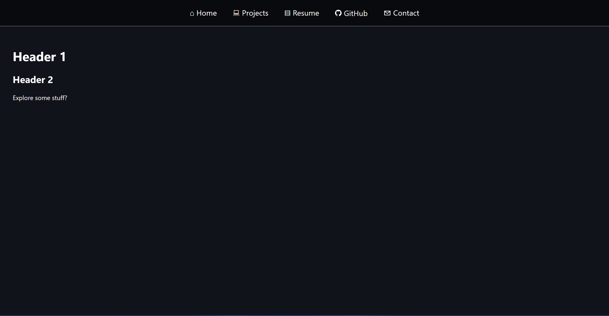
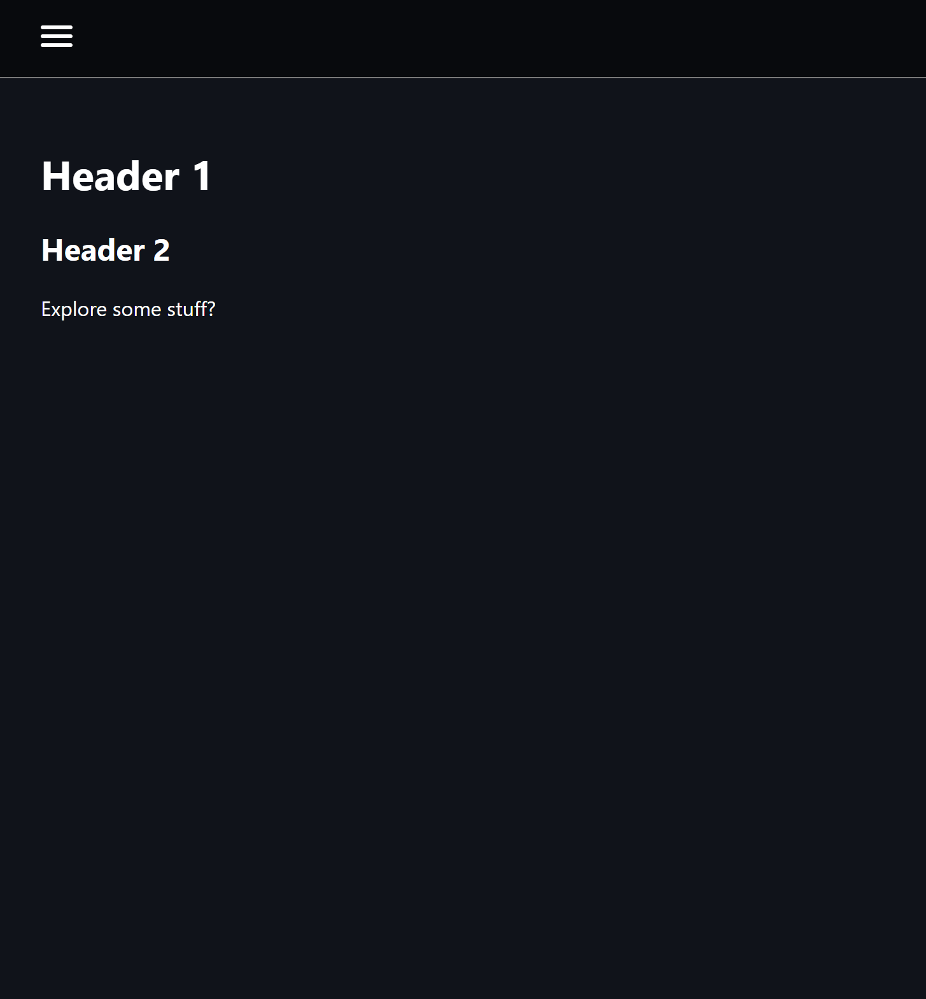

# 🌐 Jordan Waite – Personal Portfolio Website

Welcome to the source code for my personal portfolio website! This site serves as an interactive résumé and central hub for showcasing my software engineering projects, academic experience, and career background.

---

## 🎯 Project Purpose

The purpose of this project is to:

- Present my experience as a software engineering and computer science student.
- Showcase a curated set of technical projects with descriptions and links.
- Share my resume, skills, and contact information.
- Develop a responsive website that is optimized for PC and smartphone use.
- Gain practical experience in designing, developing, and deploying a modern frontend app from scratch.

---

## 🛠️ Tech Stack

This project is being built using **React + Vite** with **vanilla CSS** for full styling control:

| Tool / Tech        | Purpose                                           |
|--------------------|--------------------------------------------------|
| [React](https://reactjs.org/)              | UI components and dynamic rendering         |
| [Vite](https://vitejs.dev/)                | Blazing-fast frontend build tool            |
| [Plain CSS](https://developer.mozilla.org/en-US/docs/Web/CSS) | Fully custom styling (no frameworks)       |
| [VS Code](https://code.visualstudio.com/)  | Primary development environment             |
| [GitHub Pages](https://pages.github.com/)  | Planned deployment platform                 |
| [Custom Domain](https://namecheap.com/)    | Professional website domain (planned)       |

---

## 🚀 Deployment Plan

Deployment will be done using GitHub Pages, with a custom domain mapped via DNS. The Vite production build (`npm run build`) will output a static site that is deployable directly via GitHub Actions or manual push to the `gh-pages` branch.

---

## 🧠 Learning Goals

- Build a polished, personal website from scratch using React and CSS
- Practice component-based architecture and clean UI structure
- Customize styles without relying on a framework like Tailwind or Bootstrap
- Practice deploying modern web apps via GitHub Pages + custom domain

---

## 📬 Contact

Feel free to check out my other work or reach out:

- [My GitHub](https://github.com/Jordan1819)
- Email: jtw18199@gmail.com

---

## 📱 Screenshots

